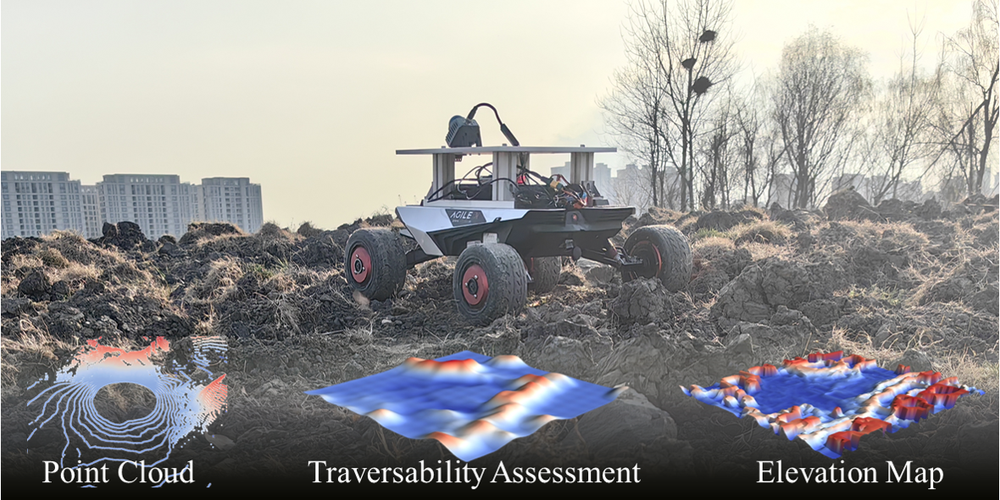

# FSGP-BGK

**Real-time Spatial-temporal Traversability Assessment via Feature-based Sparse Gaussian Process**

This repository contains the official implementation of our **IROS 2025 Oral** paper (Mapping Session).

[[Paper]](https://arxiv.org/abs/2503.04134) [[Project Page]](https://percyhzy.github.io/IROS2025-website/) [[Video (YouTube)]](https://youtu.be/T8aI8dNnIBk?si=T902PoA6iaF8JmKr) [[Video (Bilibili)]](https://www.bilibili.com/video/BV13msgztEMX/?share_source=copy_web&vd_source=c281e29c6456ee7bc965eaf485fcb88c)



---

## Abstract

Terrain analysis is critical for the practical application of ground mobile robots in real-world tasks, especially in outdoor unstructured environments. In this paper, we propose a novel spatial-temporal traversability assessment method, which aims to enable autonomous robots to effectively navigate through complex terrains. Our approach utilizes **Sparse Gaussian Processes (SGP)** to extract geometric features (curvature, gradient, elevation, etc.) directly from point cloud scans. These features are then used to construct a high-resolution local traversability map. Then, we design a spatial-temporal **Bayesian Gaussian Kernel (BGK)** inference method to dynamically evaluate traversability scores, integrating historical and real-time data while considering factors such as slope, flatness, gradient, and uncertainty metrics. GPU acceleration is applied in the feature extraction step, and the system achieves real-time performance. Extensive simulation experiments across diverse terrain scenarios demonstrate that our method outperforms SOTA approaches in both accuracy and computational efficiency. Additionally, we develop an autonomous navigation framework integrated with the traversability map and validate it with a differential driven vehicle in complex outdoor environments.

---

## What's Included

This release includes:
- ✅ **Simulation environment** (ROS1/ROS2)
- ✅ **Perception module** (FSGP-BGK traversability mapping)

**Coming Soon:**
- 🚧 Planning module (A* + MINCO trajectory optimization)
- 🚧 Quantitative experiment simulator (batch testing)
- 🚧 Isaac Sim integration
- 🚧 Hardware deployment guide and real-world examples

---

## Dependencies

```bash
# Python
pip install numpy open3d gpytorch torch cupy-cuda11x scikit-learn pyyaml

# ROS1 (Noetic)
sudo apt install ros-noetic-tf2-eigen ros-noetic-pcl-ros ros-noetic-teleop-twist-keyboard

# ROS2 (Humble)
sudo apt install ros-humble-tf2-eigen ros-humble-pcl-ros ros-humble-teleop-twist-keyboard
```

---

## Quick Start

### ROS1 (Noetic)

```bash
# Build
cd ~/FSGP-BGK
touch src/simulation_env_ros2/CATKIN_IGNORE
catkin_make
source devel/setup.bash

# Terminal 1 - Launch simulation
roslaunch simulation_env_ros1 simulation.launch

# Terminal 2 - Keyboard control
rosrun teleop_twist_keyboard teleop_twist_keyboard.py

# Terminal 3 - Run FSGP-BGK
cd src/fsgp_bgk/python
python node_ros1.py
```

### ROS2 (Humble)

```bash
# Build
cd ~/FSGP-BGK
touch src/simulation_env_ros1/COLCON_IGNORE
colcon build
source install/setup.bash

# Terminal 1 - Launch simulation
ros2 launch simulation_env simulation.launch.py

# Terminal 2 - Keyboard control
ros2 run teleop_twist_keyboard teleop_twist_keyboard

# Terminal 3 - Run FSGP-BGK
cd src/fsgp_bgk/python
python node_ros2.py
```

---

## Keyboard Controls

| Key | Action |
|-----|--------|
| `i` | Forward |
| `,` | Backward |
| `j` | Turn left |
| `l` | Turn right |
| `k` | Stop |
| `q/z` | Increase/decrease speed |

---

## Configuration

Edit parameters in:
- `src/simulation_env_ros1/config/params.yaml` (ROS1)
- `src/simulation_env_ros2/config/params.yaml` (ROS2)
- `src/fsgp_bgk/config/params.yaml` (Algorithm)

> **Note**: Update `pcd_file_path` to your local path before running.

---

## Citation

If you find this work useful, please cite:

```bibtex
@inproceedings{hou2025fsgpbgk,
  title={Real-time Spatial-temporal Traversability Assessment via Feature-based Sparse Gaussian Process},
  author={Hou, Zhenyu and Tan, Senming and Zhang, Zhihao and Xu, Long and Zhang, Mengke and He, Zhaoqi and Xu, Chao and Gao, Fei and Cao, Yanjun},
  booktitle={IEEE/RSJ International Conference on Intelligent Robots and Systems (IROS)},
  year={2025}
}
```

---

## License

This project is released under the [MIT License](LICENSE).

---

## Acknowledgments

This work was supported by the State Key Laboratory of Industrial Control Technology, Zhejiang University and Huzhou Institute of Zhejiang University.

---

## Contact

For any questions or issues, feel free to reach out:

- 📧 Email: xiagelearn@gmail.com
- 💼 LinkedIn: [linkedin.com/in/zhenyu-hou-489640299](https://linkedin.com/in/zhenyu-hou-489640299)(Looking for PhD position,personal information see in linkedin or website)  
- 🔗 Related Repository: [github.com/MarineRock10/FSGP-BGK-ROS2](https://github.com/MarineRock10/FSGP-BGK-ROS2)
